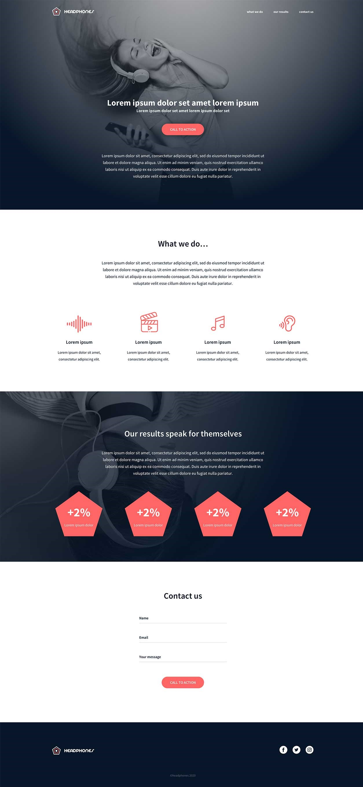

<a name="readme-top"></a>

<!-- PROJECT LOGO -->
<br />
<div align="center">
    


<!-- TABLE OF CONTENTS -->
<details>
  <summary>Table of Contents</summary>
  <ol>
    <li>
      <a href="#about-the-project">About The Project</a>
    </li>
    <li><a href="#built-with">Built With</a></li>
    <li>
      <a href="#getting-started">Getting Started</a>
    </li>
    <li><a href="#installation">Installation</a></li>
    <li><a href="#usage">Usage</a></li>
    <li><a href="#contact">Contact</a></li>
  </ol>
</details>


<!-- ABOUT THE PROJECT -->
## About The Project

This project consists of a webpage built from scratch from a Figma design file. The project was completed for the Full Stack Web Development program at Atlas School. Atlas School of Tulsa is a coding school based in Tulsa, OK that offers a 20 month program for web development.

<p align="right">(<a href="#readme-top">back to top</a>)</p>

### Built With

* HTML
* CSS

<p align="right">(<a href="#readme-top">back to top</a>)</p>

<!-- GETTING STARTED -->
## Getting Started

The webpage currently consists of HTML and CSS.

### Installation

1. Clone the repo
   ```sh
   git clone https://github.com/Jtownokie/atlas-headphones.git
   ```

<p align="right">(<a href="#readme-top">back to top</a>)</p>

<!-- USAGE EXAMPLES -->
## Usage

This repository contains the basic practice site for the Atlas School Headphones Site Project

<p align="right">(<a href="#readme-top">back to top</a>)</p>

<!-- CONTACT -->
## Contact

Christopher Stephens - [LinkedIn](https://www.linkedin.com/in/christopher-stephens-45824915b/) - christopher.stephens@atlasschool.com

Project Link: [https://github.com/Jtownokie/atlas-web-development.git](https://github.com/Jtownokie/atlas-web-development.git)

<p align="right">(<a href="#readme-top">back to top</a>)</p>
